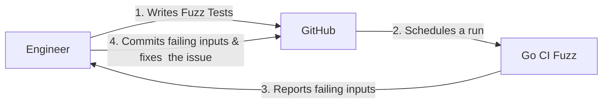

# Go CI Fuzz

CLI and set of GitHub Actions to help you run [Native Go Fuzz Tests](https://go.dev/security/fuzz/) in CI. 

It's a light wrapper around `go test -fuzz=` supporting multiple test targets.

## Motivation

This project was created to achieve a developer friendly and lightweight way of running _Native Go Fuzz Tests_ in Continuous Integration pipelines.

It implements missing functionalities in 'go test -fuzz' such as
- run multiple test targets in a single command
- extract failed outputs

Current alternatives (ClusterFuzzLite, go-fuzz, etc.) don't support _Native Go Fuzzing_ or only inadequately through wrappers.

## Workflow



## Run

### Locally

Although this tool is meant for CI pipelines, it's still useful in local development. 

If your project has many fuzz tests you can run all of them with:

```shell
go install github.com/form3tech-oss/go-ci-fuzz@{version}
go-ci-fuzz fuzz --fuzz-time 10m <packages> [--out /tmp/failures]
```

### As GitHub Action

From your own workflow, you can reference our reusable Github actions located in [./ci/github-actions](ci/github-actions). 

All fuzz findings are uploaded as artifacts to the workflow run.

Here are the Github Action properties:

```yaml
inputs:
  version:
    description: "Version of go-ci-fuzz, e.g. latest or 0.1.1"
    required: false
    default: "0.1.1"
  source-path:
    description: "Path to the project's source code, current directory by default."
    required: false
    default: "."
  fail-fast:
    description: "Whether to continue fuzzing other targets if failing input was found."
    required: false
    default: "false"
  fuzz-time:
    description: "Cumulative time FuzzTests will run, in Go time.Duration format."
    required: false
    default: "5m"
  artifact-name:
    description: "Name of the artifact"
    required: false
    default: "failing-inputs"
```

## Examples 

Here are some example workflows to incorporate in your CI pipelines. Feel free to adjust the fuzz-time according to your appetite!

### Fuzz incoming Pull Requests

```yaml
# .github/workflows/gocifuzz_pr.yml
name: Go CI Fuzz - Pull Requests
on:
  pull_request:
    
permissions:
  contents: read

jobs:
  Fuzz:
    runs-on: ubuntu-20.04
    steps:
    - uses: actions/checkout@b4ffde65f46336ab88eb53be808477a3936bae11 # v4.1.1
    - uses: actions/setup-go@93397bea11091df50f3d7e59dc26a7711a8bcfbe # v4.1.0
      with:
        go-version: stable
    - name: Run fuzzers
      id: build
      uses: form3tech-oss/go-ci-fuzz/ci/github-actions/fuzz@v0.1.1
      with:
        fuzz-time: 5m
        fail-fast: true
```

### Fuzz on fixed schedule

```yaml
# .github/workflows/gocifuzz_schedule.yml
name: Go CI Fuzz - Scheduled
on:
  workflow_dispatch: {}
  schedule:
    - cron: '0 2 * * *'

permissions:
  contents: read
  
jobs:
  Fuzz:
    runs-on: ubuntu-20.04
    steps:
    - uses: actions/checkout@b4ffde65f46336ab88eb53be808477a3936bae11 # v4.1.1
    - uses: actions/setup-go@93397bea11091df50f3d7e59dc26a7711a8bcfbe # v4.1.0
      with:
        go-version: stable
    - name: Run fuzzers
      id: build
      uses: form3tech-oss/go-ci-fuzz/ci/github-actions/fuzz@v0.1.1
      with:
        fuzz-time: 30m
        fail-fast: false
```
