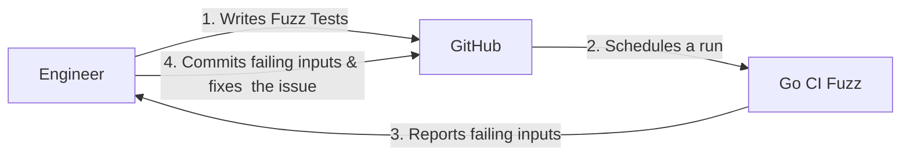

# Go CI Fuzz

`go-ci-fuzz` is a CLI and a set of GitHub Actions that help you run [Native Go Fuzz Tests](https://go.dev/security/fuzz/) as part of your CI.

It's a light wrapper around `go test -fuzz=` that supports multiple test targets.

## Motivation

`go-ci-fuzz` was created to achieve a developer friendly and lightweight way of running Native Go Fuzz Tests in Continuous Integration pipelines.
Current alternatives (ClusterFuzzLite, go-fuzz) don't support Native Go Fuzzing or support Native Go fuzzing inadequately through wrappers.

## Typical Workflow




## Running locally

Although this tool is mostly meant to be used in CI pipelines it's still useful in local development. 
If your project has many fuzz tests you can run all of them using `go-ci-fuzz`.

```bash
go install github.com/form3tech-oss/go-ci-fuzz@{version}
go-ci-fuzz fuzz --fuzz-time 10m <packages> [--out /tmp/failures]
```

## Run as part of GitHub Actions

This repo contains reusable actions located in [./ci/github-actions](ci/github-actions). 
You can reference these actions from your workflows.

All findings will be uploaded as artifacts to the workflow run.

Below you'll find example workflows to incorporate in your CI pipeline. 
Feel free to adjust the fuzz-time according to your appetite.

The Github Action accepts the following properties:

```yaml
inputs:
  version:
    description: "Version of go-ci-fuzz, e.g. latest or 0.1.0"
    required: false
    default: "0.1.0"
  source-path:
    description: "Path to the project's source code, current directory by default."
    required: false
    default: "."
  fail-fast:
    description: "Whether to continue fuzzing other targets if failing input was found."
    required: false
    default: "false"
  fuzz-time:
    description: "Cumulative time FuzzTests will run, in Go time.Duration format."
    required: false
    default: "5m"
  artifact-name:
    description: "Name of the artifact"
    required: false
    default: "failing-inputs"
```

### Fuzz incoming Pull Requests

```yaml
# .github/workflows/gocifuzz_pr.yml
name: Go CI Fuzz - Pull Requests
on:
  pull_request:
    
permissions:
  contents: read

jobs:
  Fuzz:
    runs-on: ubuntu-20.04
    steps:
    - uses: actions/checkout@b4ffde65f46336ab88eb53be808477a3936bae11 # v4.1.1
    - uses: actions/setup-go@93397bea11091df50f3d7e59dc26a7711a8bcfbe # v4.1.0
      with:
        go-version: stable
    - name: Run fuzzers
      id: build
      uses: form3tech-oss/go-ci-fuzz/ci/github-actions/fuzz@v0.1.0
      with:
        fuzz-time: 5m
        fail-fast: true
```

### Fuzz on fixed schedule

```yaml
# .github/workflows/gocifuzz_schedule.yml
name: Go CI Fuzz - Scheduled
on:
  workflow_dispatch: {}
  schedule:
    - cron: '0 2 * * *'

permissions:
  contents: read
  
jobs:
  Fuzz:
    runs-on: ubuntu-20.04
    steps:
    - uses: actions/checkout@b4ffde65f46336ab88eb53be808477a3936bae11 # v4.1.1
    - uses: actions/setup-go@93397bea11091df50f3d7e59dc26a7711a8bcfbe # v4.1.0
      with:
        go-version: stable
    - name: Run fuzzers
      id: build
      uses: form3tech-oss/go-ci-fuzz/ci/github-actions/fuzz@v0.1.0
      with:
        fuzz-time: 30m
        fail-fast: false
```
